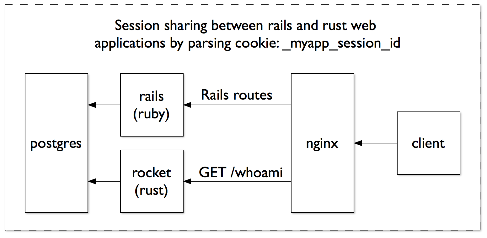

# Whoami Rocket



## Overview

Demonstration project to explore sharing user sessions between a
Ruby on Rails application and a web service written in Rust.  This
application is written using the rocket framework from https://rocket.rs

## Setup

```sh
$ cp .env.example .env
$ ROCKET_PORT=8000 cargo run --release
$ curl --cookie "_myrailsapp_session=YOUR_RAILS_SESSION_COOKIE_HERE" http://localhost:8000/whoami
```
